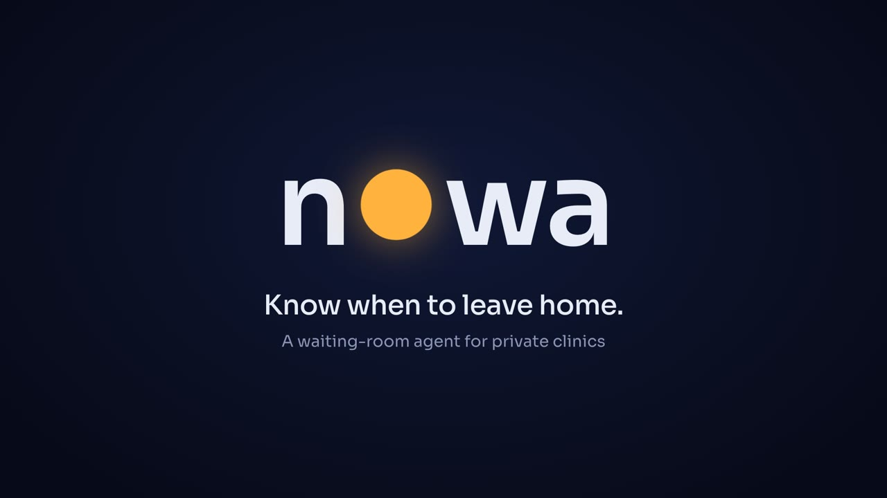
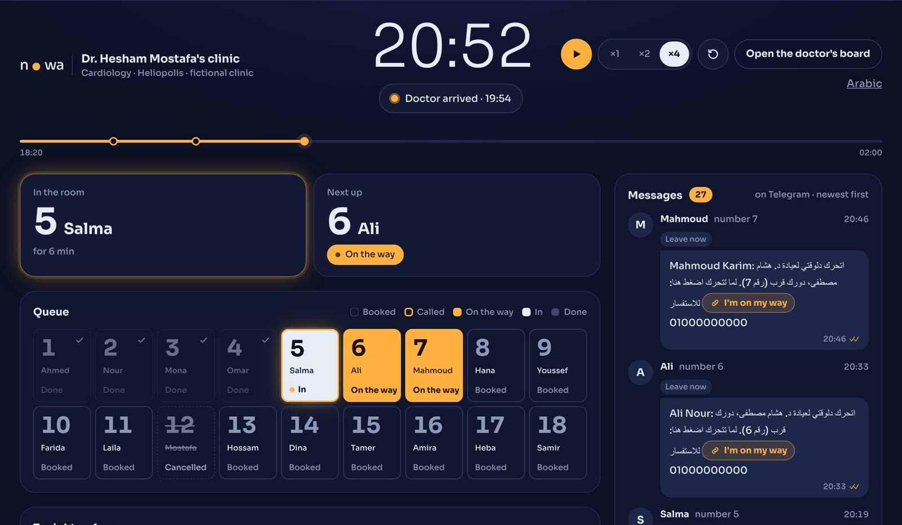

# Nowa

**Know when to leave home.**

Nowa is a waiting-room agent for private clinics in Egypt. A patient books a day and gets a queue number. The doctor taps **on my way** once, and **who comes in** after each visit. Nowa tells every patient, on Telegram, the minute to leave home.

[](https://youtu.be/rMhVKCo48XA)

**Watch the film (2:10):** https://youtu.be/rMhVKCo48XA
**Impact slides:** [docs/submission/nowa-impact-slides.pdf](docs/submission/nowa-impact-slides.pdf)

## The problem

In a private clinic in Egypt every patient is told the same time, and then the doctor is held up at the hospital. The room fills with people who are already unwell, and nobody can tell them how long they will wait.

We asked six colleagues who run private clinics. Five of the six start late, by 15 to 60 minutes. Their patients wait 45 minutes at the median and 66 on average, and in two clinics the wait passes an hour.

## What Nowa does

- **For the patient:** one Telegram message at the right minute, "leave now", worked out from the pace of the queue, their own travel time and a small cushion. They arrive just before their turn.
- **For the doctor:** two kinds of tap all evening. No second system to manage, no crowded waiting room.
- **For safety:** the AI only talks. It understands the patient, triages, and answers from approved health pages. Code alone books, times and sends. An emergency gets a fixed "call 123" reply and booking stops.



## Impact

| | Number | Basis |
|---|---|---|
| Wait on a full 30-patient evening | 229 min to 21 min (median) | Simulated, 300 evenings, assumed inputs |
| Wait in clinics today | 45 to 66 min | Survey of 6 clinics |
| Patient-hours returned per clinic per month | 100 to 190 h | Assumed 15 patients a night over 17 nights, today's wait against the simulated 21 min |
| What the doctor does | 2 kinds of tap | By design |
| Cost to run | about 1.7 EGP per patient | Estimate |
| Price | 1,500 EGP per clinic per month, about two visit fees | Proposed |

Nowa is a working prototype. It has not served a real clinic yet, so its wait results are simulated and the survey is the measurement. The first pilot is the next step.

## Run it in 5 minutes, no keys

You need Python 3.12 or newer.

```sh
git clone https://github.com/drmohpioneer/nowa && cd nowa
python -m venv .venv && source .venv/bin/activate      # Windows: .venv\Scripts\activate
pip install -r requirements.txt
python -m nowa demo
```

The browser opens http://127.0.0.1:8000 (use this exact host). Press **See Nowa working**.

1. **Watch a full evening.** Press play. One Tuesday evening of a fictional cardiology clinic runs through the real engine: 18 bookings, a cancellation, a silent patient, a no-show, a walk-in. You see the clinic clock, the doctor's state, who is in the room, every Telegram message as it lands, and the evening report at the end.
2. **Open the doctor's board** from that page. It is the board of the same evening: tap who comes in, add a walk-in, undo, close.
3. **Book as a patient.** Pick a patient, a day and an area. The confirmation lands on the drawn Telegram with a private link.

The story page, the demo hub and the Live evening open in English or Arabic by your browser language. The clinic chat, the patient page and the doctor's board are in Arabic, as Egyptian patients and doctors use them, and the Live evening labels every message in English.

The AI chat at `/c/dr-hesham` needs a Gemini key (`GEMINI_API_KEY=... python -m nowa demo`). Everything else runs with no key and no network.

## Proof it works

```sh
python -m pytest -q        # 1,298 tests, offline, no keys
ruff check nowa tests
mypy nowa
```

Three runs you can check yourself:

1. **A normal booking.** Book as a patient. The reply gives the day, the queue number and the expected time, and the drawn Telegram shows one confirmation with a private link.
2. **The same request twice does nothing twice.** Every command carries an idempotency key and a replay returns the first result: `python -m pytest -q tests/test_booking.py -k "idempotency or replay or duplicate"`.
3. **An emergency stops booking.** With a Gemini key, type "chest pain" in the clinic chat: the fixed "call 123" reply appears and no booking is offered (shown in the film). Without a key: `python -m pytest -q tests/test_message_goldens.py tests/test_messaging.py -k emergency`.

## How it works

```
Patient (web chat, Telegram)      Doctor (board, Telegram)
              |                            |
        API layer: validation, sessions, rate limits
              |
   Conversation layer: Gemini with structured output, emergency
   layer first, then the specialty's triage rules. It produces
   candidates only and has no tool that acts.
              |
   Core engine: booking, queue, timing, outbox, timers.
   Deterministic. Owns the truth.
              |
   Postgres (SQLite in the demo) -> Telegram sender, timer worker
```

Rules the code enforces:

- A booking is a day, a queue number and an expected time. The expected time only moves later, only by 20 minutes or more, and freezes after "leave now".
- Every message is one of six fixed templates filled from the database, in the patient's language (Arabic, English or Franco-Arabic).
- A Telegram chat is linked to a phone number only after the user shares their own contact and it matches.
- Every action is safe to repeat. Names and phones live only in the identity tables.

Built to fail safely:

- **The AI provider is slow or down.** The chat falls back through a chain of models to a fixed reply. Booking by buttons and the timing engine never need a model.
- **Telegram cannot deliver.** The message is marked failed and the doctor is alerted once.
- **The travel service fails.** Nowa uses a fixed travel time for the patient's area.
- **The doctor has not tapped by opening time.** Nowa reminds the doctor on Telegram.

In the demo, the people and their actions in the Live evening are scripted; the engine computes everything that follows. The drawn Telegram stands in for the real bot, and travel times are fixed per Cairo area. With keys configured, the same code uses the Telegram Bot API and live Mapbox traffic.

## Roadmap

1. **A first pilot with three doctors.** Measure the real wait and how often doctors and patients tap. Test the price.
2. **SMS as a second channel** for patients who do not use Telegram, after a carrier contract and a field test. WhatsApp follows if the pilot shows the need.
3. **Data protection licences.** Egypt's Law 151 of 2020 requires them before holding real patient data. The design already keeps names and phones in separate identity tables.
4. **More specialties.** Cardiology triage rules are in place; other specialties follow after specialist review.
5. **Later.** A voice assistant that answers the clinic phone, and patient follow-up built on the visit history.

## More

- Environment names for your own instance: [.env.example](.env.example)
- The queue simulator behind the wait numbers: [docs/reference/sim.py](docs/reference/sim.py)

Built by Dr Mohamed Mostafa, cardiologist, Cairo, for Agents at Work 2026. Designed by the doctor and built with two AI agents in fixed roles: one writes the code, the other specifies and reviews it.
